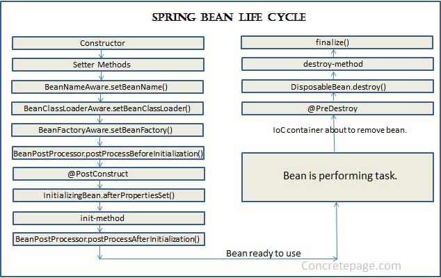

# ANNOTATION CONFIGURATION

*Note*: Trong bài này chỉ tìm hiểu một số annotation cơ bản và quen thuộc, một số khác được giới thiệu ở các bài sau.

## 1. `@Required`

`@Required` là một annotation của Spring dùng cho hàm set của một thuộc tính nào đó trong một class nhất định
Demo annotation này có thể xem ở class Clazz.

Annotation này chỉ sử dụng được cho hàm set, nếu cố tình đặt chỗ khác như là thuộc tính, class, ... sẽ bị lỗi.

Annotation này là 1 trong các annotation đời đầu của Spring, hiện tại đã được khuyến nghị không nên sử dụng (deprecated)
nên chỉ giới thiệu mà không nên áp dụng trong thực tế.

## 2. `@Autowired`

`@Autowired` là một annotation của Spring dùng để inject sự phụ thuộc trong một bean, đây là một annotation được sử dụng phổ biến và khuyến nghị.
Demo annotation này ở bean/book.

Trong class `Book` có 2 thuộc tính cần chú ý: `Publisher` và `Author`, đó là 2 thuộc tính thuộc 2 class khác
mà 2 class đó là 2 bean, `book` cũng là 1 bean. Nói cách khác, bean `Book` đang phụ thuộc vào 2 bean còn lại.
Vì vậy, annotation `@Autowired` được sử dụng để đánh dấu rằng sự phụ thuộc của `Book` lên 2 bean còn lại
để Spring inject vào như là cách config ở file xml. Có điều config bằng annotation này sẽ tiện lợi và ngắn hơn nhiều.
Trong file config xml chỉ cần định nghĩa ra các bean là đủ.

Annotation này có thể sử dụng ở cả setter và cả thuộc tính đều được.

## 3. `@Qualifer`

`@Qualifer` là một annotation của Spring thường được sử dụng kèm với `@Autowired`  khi cần thiết.
     
Nhiệm vụ của nó là chỉ rõ bean nào được `autowired` khi có nhiều bean của class đó.
Ví dụ trong class `Student`, ta có autowired `Clazz`, 
nhưng trong file config ta có 2 bean của `Clazz`, đó là `clazz` và `clazzImpl`,

Nhiệm vụ của ta là phải chỉ rõ bean mà ta mong muốn inject để Spring `autowired` vào trong `student`,
trong bài này nếu không dùng `@Qualifier` thì Spring sẽ mặc định inject bean đầu tiên có kiểu là `Clazz` mà nó tìm thấy,

Trong nhiều trường hợp khác, ở các dự án phức tạp, lượng bean lớn và khó kiểm soát,
nếu ta không sử dụng `@Qualifier` một cách đúng đắn và hợp lý sẽ gây ra exception.

## 4. `@PostConstruct` & `@PreDestroy`

Đây là 2 annotation liên quan tới vòng đời của một bean.

Khi khởi tạo 1 bean, obj được khởi tạo trước, tức là constructor, setter sẽ được gọi trước.
Sau đó là Spring sẽ tạo bean, hàm nơi có annotation `@PostConstruct` sẽ được gọi.
Trong hàm đó chúng ta sẽ thực hiện xử lý một số nghiệp vụ cần thiết cho từng bài toán cụ thể
Tương tự, trước khi bean bị phá hủy bởi IoC container thì hàm có annotation `@PreDestroy` sẽ được gọi.

Demo trong class [`Car`](./src/main/java/com/github/truongbb/bean/others/Car.java)

## 5. `@Resource`

Annotation này là sự kết hợp của `@Autowired` và `@Qualifier`. Tức là bean được `autowired` và được chỉ rõ là bean nào (nếu sử dụng thuộc tính name của `@Resource`)

Ví dụ ở class [`Student`](./src/main/java/com/github/truongbb/bean/student/Student.java)
     
