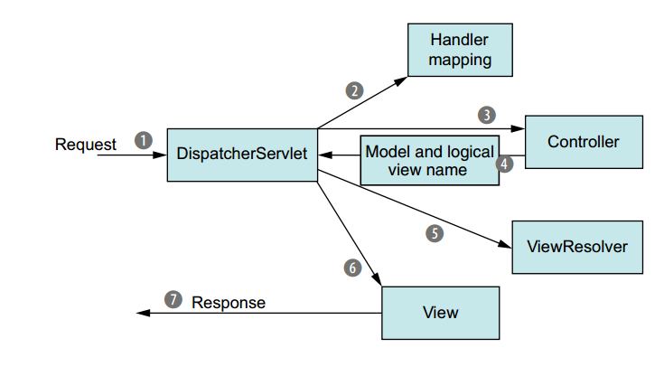

# Spring web MVC - Hello world

Note: Cắm tomcat vào mà chạy project.


Là 1 nhánh của Spring framework được sử dụng cho các ứng dụng web theo mô hình MVC.
Mô hình của Spring MVC được thể hiện ở trong ảnh.



<br/>
1. Khi một `request` được gửi đi từ phía client mang theo thông tin tới server.
`Request` đó được tiếp nhận bởi 1 bộ phận gọi là `DispatcherServlet` - bộ phận quan trọng đóng vai trò điều hướng của Spring MVC.

2. Từ đây, `dispatcher` sẽ đọc `request` và chuyển tới `controller` tương ứng. Nhưng trong một ứng dụng sẽ có rất nhiều `controller` khác nhau.
Làm sao để nó nhận biết để đưa `request` đó tới `controller` tương ứng? Bước đó chính là bước đọc cấu hình `Handler mapping`.
Trong bước này, `dispatcher` sẽ map giữa `controller` mà `request` muốn gọi (trong bước đọc `request` ở trước) với `handler mapping` được cấu hình,
và nó sẽ ánh xạ chính xác `controller` mà `request` muốn gọi tới, sau đó `dispatcher` sẽ chuyển hướng `request` này tới cho `controller` tương ứng xử lý.

4. Tới `controller` xử lý, tùy theo nghiệp vụ bài toán mà nó sẽ xử lý, lấy dữ liệu DB, lọc, ... sử dụng `model` và `logical view name`
để sẵn sàng trả ra kết quả.

5. Sau khi thực hiện và trả ra kết quả là 1 `view` xong. Kết quả này sẽ được chuyển tới `DispatcherServlet` một lần nữa, để nó map với `View` tương ứng ở `ViewResolver`,

6. Lấy được view xong thì sẽ đóng gói vào `Response` trả về cho phía client.


Trong ví dụ `HelloWorld` đầu tiên này chưa làm rõ handler mapping, ở bài sau sẽ rõ hơn.


Chú ý:
- File `web.xml` là file cấu hình cho project web, được để ở thư mục `WEB-INF` bên trong `webapp`.
   Tại đây có thuộc tính `contextParam` để trỏ tới file `applicationContext` (cấu hình bean) của Spring.
   Nhưng file `applicationContext` lại không được đặt là `applicationContext.xml` nữa vì bên dưới có cấu hình `servlet name` là `helloWeb`,
   vì vậy file bean cấu hình bắt buộc phải đặt là `helloWeb-servlet.xml`,
   có thể tùy ý sửa đổi nhưng khi `servlet-name` là "abc" thì file cấu hình bean phải là "abc-servlet.xml".
   Đây là một dấu hiệu nhận biết tự động của Spring mvc khi khởi chạy project.
   Chú ý rằng `servlet-name` ở thuộc tính `servlet` và `servlet-mapping` phải khớp nhau, không khớp là oẳng.

   Ngoài ra, việc cấu hình url cũng được thực hiện trong file này ở thuộc tính `url-pattern`,
   khi cấu hình giá trị tại đây, thì url khi gọi tới api ở controller sẽ là:

```xml
http(s)://<ip>:<port>/<project_name (nếu có config khác ở tomcat thì sửa chỗ này)>/<giá trị config trong url-pattern>/<requestMapping trong controller tương ứng>/<requestMapping ở các hàm trong controller tương ứng>
```

- Trong mỗi `controller`, ở trên của class đều có `@Controller`, đây là một `annotation` của Spring MVC để định nghĩa rằng đây là một bean `controller` được spring quản lý,
   `@RequestMapping` chỉ ra URL khi gọi tới nó. Bên dưới, mỗi hàm đều có `@RequestMapping`, bên trong chứa phương thức và giá trị tương ứng,
   để khi request gọi tới `controller` rồi sẽ tới hàm tương ứng với `@RequestMapping` được định nghĩa ở đầu hàm để thực hiện chức năng.

   Nếu như hàm nào trong `controller` không để giá trị value của `@RequestMapping` thì hàm đó auto được gọi khi URL chỉ tới level controller.
   Ví dụ trong `HelloController` có hàm `helloWorld` đầu tiên không có value ở `@RequestMapping`, thì khi gọi tới API
   `http://localhost:8080/spring10_springMvc_helloWorld/hello`
   là nó tự gọi vào hàm `helloWorld` (hàm không định nghĩa ra value trong `controller` thì sẽ là hàm xử lý mặc định của `controller` đó).

   Thế thì nếu cố tình có 2 hàm mặc định thì sao (trong `HelloController` đang để 2 hàm là `helloWorld` và `helloWorld1`)
   --> tất nhiên là ếu chạy được.

   Chú ý method trong `controller` nên để `public`, để `private` sẽ gây lỗi ở một số trường hợp.


- Trong ví dụ này mỗi `controller` trả ra 1 chuỗi String, đây chính là tên của file `View` mà sẽ trả về client.
   Nó sẽ cùng với config ở `helloWeb-servlet.xml` để lấy ra được `view` tương ứng.
   Ví dụ trả về "Hello", nó sẽ có `prefix` (config ở `helloWeb-servlet`) là `/WEB-INF/jsp/` và `suffix` là `.jsp`
   --> vậy, view trả ra sẽ là `/WEB-INF/jsp/Hello.jsp`

   Nếu cố tình trả ra view không tồn tại thì tất nhiên sẽ bắn ra `404`.
