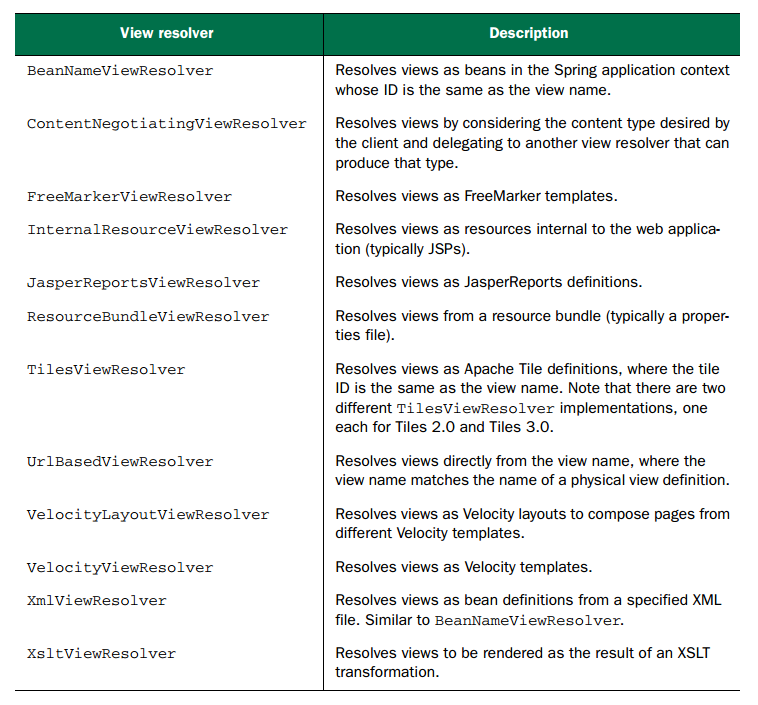

# Spring web MVC - VIEW RESOLVER



Có 1 số loại view resolver của Spring MVC như sau:
- Internal Resource View Resolver
- Xml View Resolver
- Resource Bundle View Resolver

Mỗi loại có một đặc trưng và cách dùng riêng, hoặc có thể dùng cả 3 loại trong 1 project.

## 1. Internal Resource View Resolver
Trong file `dispatcher-servlet` ta cấu hình bean có class là `org.springframework.web.servlet.view.InternalResourceViewResolver`
nghĩa là ta đang sư dụng `Internal Resource View Resolver`

```xml
<bean class="org.springframework.web.servlet.view.InternalResourceViewResolver">
   <property name="prefix" value="/"/>
   <property name="suffix" value=".jsp"/>
</bean>
```

## 2, Xml View Resolver
Cái này lại như một kiểu sử dụng gián tiếp, nó sẽ thông qua một file cấu hình xml bean nữa rồi mới tới trang `jsp` thực sự mà ta cần
Xem file `dispatcher-servlet` để biết thêm chi tiết.


# 3. Resource Bundle View Resolver
Đúng như tên gọi của nó, Resource Bundle cũng có kiểu cấu hình gián tiếp giống với Xml bên trên,
nhưng thay vì sử dụng file xml, nó sẽ sử dụng file properties để cấu hình gián tiếp (resource bundle mà)
Xem file `dispatcher-servlet` để biết thêm chi tiết

Ngoài ra còn có các view resolver khác như trong ảnh mô tả, mỗi loại cũng có các cách sử dụng và cấu hình khác nhau,
sử dụng các thẻ được hỗ trợ riêng cho view resolver khác nhau như `thymeleaf`, `sf`, ...
