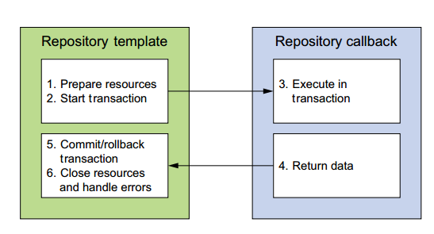

# Spring data - INTRODUCTION

Spring data là một phần của Spring framework giúp ta có thể thực hiện các thao tác ở tầng dữ liệu,
hay nói một cách khác là thao tác với database.
Trong hệ sinh thái của Spring data, có rất nhiều công cụ để chúng ta có thể thực hiện các thao tác với DB rất tiện lợi,
tốn ít công và quản lý exception tốt hơn.

Về mặt kiến trúc tổng quan, để giảm bớt sự gắn kết, phụ thuộc vào tầng service, Spring sẽ sử dụng interface để giao tiếp với tầng service
khi tầng service gọi tới repository để thực hiện lấy dữ liệu.
Mặc cho DB sử dụng là gì, framework sử dụng là gì đi nữa thì Spring data sẽ lo chuyện thực hiện đó.

             __________________________           ________________________
            |                          |         |                        |
            |     Service object       |  ===>   |       Repository       |
            |    (from service tier)   |         |       interface        |
            |__________________________|         |________________________|
                                                             /\
                                                             ||
                                                             ||
                                                  ________________________
                                                 |                        |
                                                 |       Repository       |
                                                 |     implementation     |
                                                 |________________________|

Kiến trúc này cũng được áp dụng hệt với tầng service khi controller (spring MVC) gọi tới.
Vì vậy, trong project này cũng sẽ implement theo cách như vậy.

Khi thao tác vói DB, ta đều có hành động kết nối tới, thực hiện truy vấn hoặc thay đổi dữ liệu,
sau đó xong việc thì thực hiện đóng kết nối, xóa các `resource` cần thiết.
Mỗi công đoạn như thế thường được làm lặp lại trong mỗi lần mò tới tầng `data-acccess`.
Spring sẽ chia các phần công việc như trên do 2 nhóm classes quản lý và thực hiện:
- `Repository template`: sẽ thực hiện các công việc mang tính chất không thay đổi (fixed parts),
ví dụ như chuẩn bị kết nối, mở kết nối, start transaction, commit hoặc rollback, đóng kết nối và xử lý errors liên quan.
- `Repository callback` thực hiện các tác vụ động hoặc có thay đỏi như là nội dung của các phiên giao dịch,
có thể là query, create, update,... hoặc trả về kết quả.
(Spring’s data-access template classes take responsibility for common data-access duties. For application-specific tasks,
it calls back into a custom callback object.)

Spring có cả tá template hỗ trợ để xử lý các thao tác như trên nói, như:
- `jca.cci.core.CciTemplate`: JCA CCI connections
- `jdbc.core.JdbcTemplate`: JDBC connections
- `jdbc.core.namedparam.NamedParameterJdbcTemplate`: JDBC connections with support for named parameters
- `jdbc.core.simple.SimpleJdbcTemplate`: JDBC connections, simplified with Java 5 constructs (bị bỏ đi từ Spring 3.1)
- `orm.hibernate3.HibernateTemplate`: Hibernate 3.x+ session
- `orm.ibatis.SqlMapClientTemplate`: iBATIS SqlMap clients
- `orm.jdo.JdoTemplate`: Java Data Object implementations
- `orm.jpa.JpaTemplate`: Java Persistence API entity managers

Trong tut này, chúng ta sẽ chỉ sử dụng tới `JdbcTemplate`, `NamedParameterJdbcTemplate` và `HibernateTemplate`
là 3 cái được sử dụng phổ biến nhất mà thôi.

Spring coi các DB là các data source được config như một bean, có rất nhiều cách config bean:
- Sử dụng `JNDI`
- Sử dụng `pooled data source`
- Sử dụng J`DBC driver-based data sources` (dùng file xml, hoặc java để config, có thể chia môi trường stagging, production, ... ) --> hay sử dụng cách này

Trong ví dụ phần này sẽ sử dụng `JdbcTemplate`, `NamedParameterJdbcTemplate` và cấu hình bằng xml file.
Các cách sử dụng `JdbcTemplate`, `NamedParameterJdbcTemplate` xin xem tại [`repository`](./src/main/java/com/github/truongbb/repository/StudentRepositoryImpl.java)
